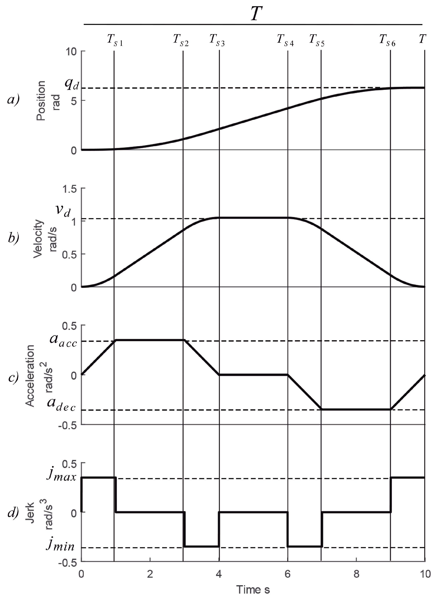

# 1DoF_Control
# S-Curve Trajectory Generator

Library สำหรับสร้าง jerk-limited motion profile แบบ 7-phase บน STM32 NUCLEO-G474RE
ออกแบบมาเพื่อใช้งานร่วมกับ cascade control loop สำหรับหุ่นยนต์แขน 1 DOF

---

## สารบัญ

- [ภาพรวม](#ภาพรวม)
- [ไฟล์ที่เกี่ยวข้อง](#ไฟล์ที่เกี่ยวข้อง)
- [การตั้งค่า](#การตั้งค่า)
- [โครงสร้างข้อมูล](#โครงสร้างข้อมูล)
- [API Reference](#api-reference)
- [การใช้งานกับ Cascade Control](#การใช้งานกับ-cascade-control)
- [การใช้งาน Waypoints](#การใช้งาน-waypoints)
- [สิ่งที่ต้องระวัง](#สิ่งที่ต้องระวัง)
- [Checklist ก่อน Deploy](#checklist-ก่อน-deploy)

---

## ภาพรวม

S-Curve Trajectory Generator ทำหน้าที่สร้าง **reference signal** ที่มี jerk จำกัด
โดย output ที่ได้ในแต่ละ timestep ประกอบด้วย position, velocity, และ acceleration
ซึ่งนำไปใช้เป็น setpoint และ feedforward ในแต่ละชั้นของ cascade control ได้โดยตรง

### ทำไมต้องใช้ S-Curve?

| คุณสมบัติ | Trapezoidal | S-Curve |
|---|---|---|
| Jerk | ไม่จำกัด (กระตุก) | จำกัด (นุ่มนวล) |
| การสั่นสะเทือน | มาก | น้อย |
| ความซับซ้อน | ต่ำ | สูงกว่า |

### 7-Phase Model

```
Phase 1 : jerk = +J_max  →  accel เพิ่มขึ้น
Phase 2 : jerk =  0      →  accel คงที่ที่ A_max
Phase 3 : jerk = -J_max  →  accel ลดลงเป็น 0
Phase 4 : accel = 0      →  velocity คงที่ (cruise)
Phase 5 : jerk = -J_max  →  เริ่มเบรก, accel ลงติดลบ
Phase 6 : jerk =  0      →  accel คงที่ที่ -A_max
Phase 7 : jerk = +J_max  →  accel กลับขึ้นมาเป็น 0
```

Phase 5–7 สมมาตรกับ Phase 3–1 พอดี

---

## ไฟล์ที่เกี่ยวข้อง

```
scurve_trajectory.h   ←  type definitions, constants, function prototypes
scurve_trajectory.c   ←  implementation (ไฟล์นี้)
```

Include ในโปรเจกต์:

```c
#include "scurve_trajectory.h"
```

---

## การตั้งค่า

แก้ค่าใน `scurve_trajectory.h` ให้เหมาะกับ motor จริงก่อนใช้งาน:

```c
#define SCURVE_V_MAX_DEG_S      // ความเร็วสูงสุด [deg/s]
#define SCURVE_A_MAX_DEG_S2     // acceleration สูงสุด [deg/s²]
#define SCURVE_J_MAX_DEG_S3     // jerk สูงสุด [deg/s³]
#define TRAJ_DT                 // control loop period [s]  เช่น 0.001f = 1 kHz
#define WAYPOINT_COUNT          // จำนวน waypoints
```

> **สำคัญ:** ตั้งค่าทั้ง 3 limits ให้ไม่เกิน spec ของ motor และ drive จริง
> และ `TRAJ_DT` ต้องตรงกับ interrupt period จริงของระบบ

---

## โครงสร้างข้อมูล

### `SCurveTraj_t`

State machine หลักของ trajectory ประกาศ **1 ตัวต่อ 1 แกน**

```c
SCurveTraj_t traj;
```

### `TrajOutput_t`

Output ที่ได้จาก `SCurve_Update()` ในแต่ละ timestep

```c
typedef struct {
    float position_deg;     // position reference  [deg]
    float velocity_deg_s;   // velocity reference  [deg/s]
    float accel_deg_s2;     // acceleration reference [deg/s²]
} TrajOutput_t;
```

---

## API Reference

### `SCurve_Init()`

```c
void SCurve_Init(SCurveTraj_t *traj);
```

Initialize state machine รีเซ็ตทุก field เป็น 0 และตั้ง state เป็น `TRAJ_IDLE`

> เรียกครั้งเดียวตอน startup หรือหลัง reset เท่านั้น

---

### `SCurve_SetSegment()`

```c
void SCurve_SetSegment(SCurveTraj_t *traj, float q_start, float q_end);
```

กำหนด point-to-point segment ใหม่ ระบบจะคำนวณระยะเวลาแต่ละ phase อัตโนมัติ
รวมถึงจัดการ short move (ระยะสั้น) ด้วย bisection search

| Parameter | คำอธิบาย |
|---|---|
| `traj` | pointer ไปยัง state machine |
| `q_start` | ตำแหน่งเริ่มต้น [deg] — ควรอ่านจาก encoder จริง |
| `q_end` | ตำแหน่งเป้าหมาย [deg] |

---

### `SCurve_Update()`

```c
TrajOutput_t SCurve_Update(SCurveTraj_t *traj);
```

คำนวณ reference ณ timestep ปัจจุบัน **ต้องเรียกทุก `TRAJ_DT` วินาที** ด้วยความถี่คงที่

คืนค่า `TrajOutput_t` ที่มี position, velocity, acceleration reference

---

### `SCurve_IsDone()`

```c
bool SCurve_IsDone(const SCurveTraj_t *traj);
```

คืนค่า `true` เมื่อ trajectory เสร็จสิ้น (`TRAJ_DONE`) หรือยังไม่เริ่ม (`TRAJ_IDLE`)

---

### `SCurve_RunWaypoints()`

```c
TrajOutput_t SCurve_RunWaypoints(SCurveTraj_t *traj, float current_pos);
```

เรียกใช้ waypoint list อัตโนมัติ เมื่อ segment หนึ่งเสร็จจะขยับไป waypoint ถัดไปเอง
แทน `SCurve_Update()` ได้เลยในกรณีที่ใช้ waypoints

---

## การใช้งานกับ Cascade Control

### ขั้นตอนพื้นฐาน

```c
// 1. Init (ทำครั้งเดียว)
SCurveTraj_t traj;
SCurve_Init(&traj);

// 2. กำหนด segment (อ่านตำแหน่งจริงจาก encoder เสมอ)
SCurve_SetSegment(&traj, encoder_read_deg(), 180.0f);

// 3. เรียกใน control loop ทุก TRAJ_DT
TrajOutput_t ref = SCurve_Update(&traj);

// 4. ส่ง reference ไปยัง controller
// ref.position_deg   → setpoint ของ outer loop
// ref.velocity_deg_s → velocity feedforward
// ref.accel_deg_s2   → acceleration feedforward

// 5. ตรวจสิ้นสุด
if (SCurve_IsDone(&traj)) {
    // เริ่ม segment ใหม่หรือหยุด
}
```

---

### Cascade 2 ชั้น (Position + Velocity)

เหมาะสำหรับ DC motor หรือ stepper ทั่วไป

```
ref.position_deg ──→ [+]──→ [ Position PID ] ──→ vel_setpoint
          actual_pos ──→[−]↗
                                   ↓
              ref.velocity_deg_s ─(+) ← velocity feedforward
                                   ↓
                        [+]──→ [ Velocity PID ] ──→ pwm / torque
              actual_vel ──→[−]↗
                                   ↑
              ref.accel_deg_s2 ──(Kff)
```

```c
TrajOutput_t ref = SCurve_Update(&traj);

// Outer loop: position
float pos_error    = ref.position_deg - encoder_get_deg();
float vel_setpoint = pid_update(&pos_pid, pos_error)
                   + ref.velocity_deg_s;        // velocity feedforward

// Inner loop: velocity
float vel_error = vel_setpoint - encoder_get_vel_deg_s();
float output    = pid_update(&vel_pid, vel_error)
                + Kff_accel * ref.accel_deg_s2; // accel feedforward

motor_set_pwm(output);
```

---

### Cascade 3 ชั้น (Position + Velocity + Current)

เหมาะสำหรับ BLDC หรือ servo drive ที่ควบคุม torque ได้

```
ref.position_deg  ──→ [ Position P   ] ──→ vel_cmd
ref.velocity_deg_s──→ (feedforward)  ──↗
                                          ↓
                       [ Velocity PI  ] ──→ iq_cmd
ref.accel_deg_s2  ──→ (J/Kt × accel) ──↗
                                          ↓
                       [ Current PI   ] ──→ PWM / SVPWM
```

```c
TrajOutput_t ref = SCurve_Update(&traj);

// Loop 1: position (ใช้ P controller เพราะมี vel feedforward)
float vel_cmd = Kp_pos * (ref.position_deg - encoder_get_deg())
              + ref.velocity_deg_s;

// Loop 2: velocity (+ inertia feedforward)
float iq_cmd = Kp_vel * (vel_cmd - encoder_get_vel_deg_s())
             + Ki_vel * vel_integrator
             + (J_motor / Kt) * ref.accel_deg_s2;

// Loop 3: current (ทำใน inner ISR)
float pwm = current_controller_update(iq_cmd, adc_read_current());
```

---

### การใช้ Feedforward อย่างถูกต้อง

| Signal | ใช้เป็น | ประโยชน์ |
|---|---|---|
| `position_deg` | setpoint ของ outer loop | error term หลัก |
| `velocity_deg_s` | velocity feedforward | ลด lag ของ position loop |
| `accel_deg_s2` | inertia feedforward | ลด tracking error ช่วงเร่ง/เบรก |

**แนวทาง tune feedforward gain:**
- เริ่มที่ `Kff_vel = 1.0` แล้วปรับลงถ้าเกิด overshoot
- `Kff_accel = J_total / Kt` โดย `J_total` คือ inertia รวมของแขน + motor

---

## การใช้งาน Waypoints

กำหนด waypoints ใน `scurve_trajectory.c`:

```c
const float WAYPOINTS_DEG[WAYPOINT_COUNT] = {90.0f, 180.0f, 360.0f, 180.0f, 270.0f};
```

ใช้งานใน control loop แทน `SCurve_Update()`:

```c
TrajOutput_t ref = SCurve_RunWaypoints(&traj, encoder_get_deg());

// ส่งไปยัง controller เหมือนเดิม
pos_controller_setpoint(ref.position_deg);
vel_feedforward(ref.velocity_deg_s);
accel_feedforward(ref.accel_deg_s2);
```

> ถ้าต้องการเปลี่ยน waypoints แบบ dynamic ให้ refactor `WAYPOINTS_DEG` เป็น pointer array
> และเพิ่ม setter function เพื่อความปลอดภัย

---

## สิ่งที่ต้องระวัง

**Timing drift** — `TRAJ_DT` ต้องตรงกับ period จริงของ loop ถ้า jitter มาก trajectory จะ drift
เพราะ generator ใช้เวลาสะสม ไม่ใช่ absolute timestamp แนะนำให้เรียก `SCurve_Update()`
ใน hardware timer ISR หรือ RTOS task ที่มี period แน่นอน

**Unit consistency** — ทุกค่าใช้หน่วย degree ถ้า controller ใช้ radian ต้องแปลงก่อน:

```c
float pos_rad = ref.position_deg * (M_PI / 180.0f);
float vel_rad = ref.velocity_deg_s * (M_PI / 180.0f);
float acc_rad = ref.accel_deg_s2  * (M_PI / 180.0f);
```

**Initial position** — ตอนเรียก `SCurve_SetSegment()` ให้ส่ง encoder ค่าจริงเป็น `q_start` เสมอ
ไม่ใช่ค่า hardcode เพื่อป้องกัน position jump ตอนเริ่ม segment ใหม่

**ไม่มี runtime clamp** — ถ้าต้องการความปลอดภัยสูง ให้เพิ่ม clamp หลัง `SCurve_Update()`:

```c
TrajOutput_t ref = SCurve_Update(&traj);
ref.velocity_deg_s = CLAMP(ref.velocity_deg_s, -SCURVE_V_MAX_DEG_S, SCURVE_V_MAX_DEG_S);
ref.accel_deg_s2   = CLAMP(ref.accel_deg_s2,   -SCURVE_A_MAX_DEG_S2, SCURVE_A_MAX_DEG_S2);
```

ป้องกัน floating-point error สะสมในกรณี short move ที่ bisection ไม่ converge พอดี

**ไม่มี hardware protection** — library นี้เป็น software limit เท่านั้น
ควรมี hardware end-switch, current limit, และ watchdog แยกต่างหากในระบบจริง

---

## Checklist ก่อน Deploy

- [ ] ตั้งค่า `SCURVE_V_MAX`, `SCURVE_A_MAX`, `SCURVE_J_MAX` ให้ไม่เกิน spec ของ motor จริง
- [ ] ตรวจสอบ `TRAJ_DT` ตรงกับ interrupt period จริง
- [ ] เรียก `SCurve_Update()` ใน loop เดียวกับ controller ไม่ใช่คนละ task โดยไม่ sync
- [ ] ทดสอบ short move (เช่น 1–5 deg) ว่า bisection ทำงานถูกต้อง
- [ ] ทดสอบ direction กลับ (เช่น 180° → 90°) ว่า sign ถูกต้อง
- [ ] log `position_deg`, `velocity_deg_s`, `accel_deg_s2` ออกมา plot ดูรูปร่าง S-curve ก่อนต่อ motor จริง
- [ ] เพิ่ม runtime clamp ถ้าระบบต้องการความปลอดภัยสูง
